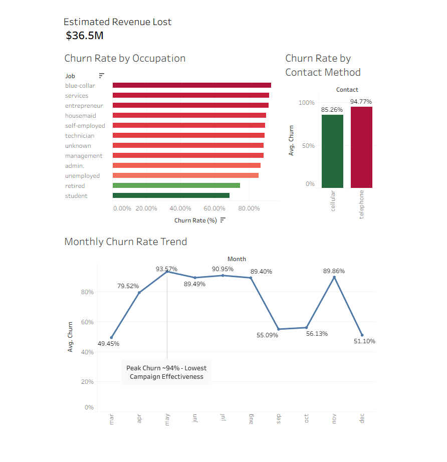

# Bank Marketing Churn Analysis

## Overview
This project explores customer churn behavior using a real-world banking dataset of over 41,000 records. The goal was to uncover key drivers of non-conversion and translate analytical findings into measurable business impact.

## Key Findings
- Customer churn (~89%) represents a significant loss in potential revenue
- Seasonality emerged as the strongest driver, with churn varying by over 40 percentage points across months
- Communication channel had a major impact, with telephone outreach underperforming compared to cellular
- Customer segmentation revealed that certain job categories were significantly less responsive to campaigns

## Business Impact
By estimating customer value, this analysis identified approximately **$36.5M in lost revenue**, demonstrating how improved targeting and campaign timing could significantly enhance performance.

## Tools & Methods
- Data cleaning and analysis using Python (Pandas)
- Exploratory data analysis and segmentation techniques
- Interactive dashboard built in Tableau for stakeholder insights

## Dashboard

